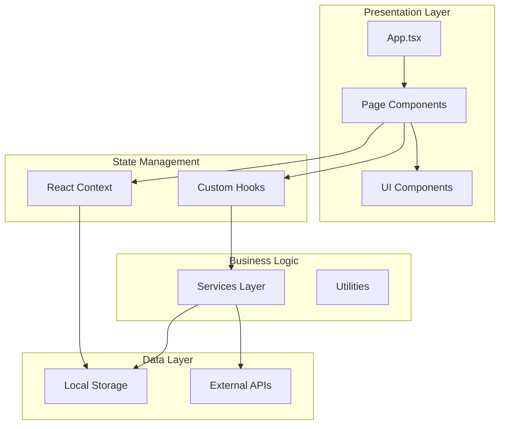
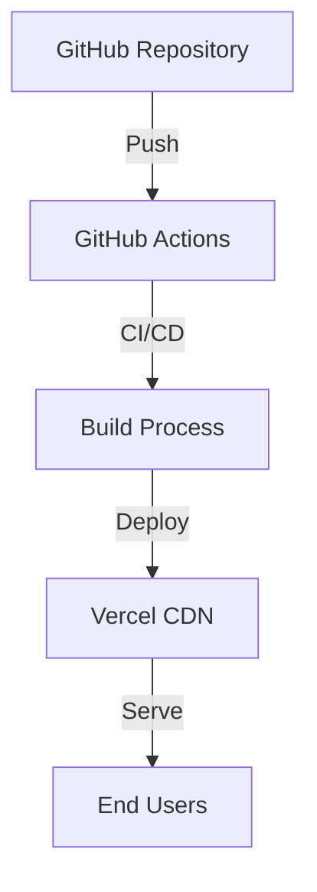

# Architecture Documentation

## System Overview

Closet Muse is a client-side React application built with TypeScript and Vite. The architecture follows modern React patterns with a focus on modularity, type safety, and maintainability.

## Architecture Diagram



## Core Principles

### 1. Component-Based Architecture

- **Atomic Design**: Components organized from atoms to organisms
- **Composition**: Prefer composition over inheritance
- **Single Responsibility**: Each component has one clear purpose

### 2. Type Safety

- **TypeScript First**: All code written in TypeScript
- **Strict Mode**: Enabled for maximum type safety
- **Shared Types**: Centralized type definitions in `src/shared/types/`

### 3. State Management

- **React Context**: Global state for wardrobe, outfits, and user data
- **Local State**: Component-level state with useState
- **Derived State**: Computed values using useMemo

### 4. Data Flow

```
User Action → Component → Hook → Service → Storage/API
                ↓
            Context Update
                ↓
            Re-render
```

## Directory Structure

### `/src/components`

React components organized by feature:

- `HomeDashboard.tsx` - Main dashboard view
- `WardrobeManager.tsx` - Wardrobe management
- `OutfitBuilder.tsx` - Outfit creation
- `OutfitCalendar.tsx` - Calendar planning
- `ProfilePage.tsx` - User profile
- `ui/` - Reusable UI components (Radix UI based)

### `/src/contexts`

React Context providers:

- `AppContext.tsx` - Global application state

### `/src/services`

Business logic and external integrations:

- `weatherService.ts` - Weather API integration
- `outfitRecommendationService.ts` - AI recommendations

### `/src/shared`

Shared utilities and resources:

- `components/` - Shared components (ErrorBoundary)
- `types/` - TypeScript type definitions
- `constants/` - Application constants
- `utils/` - Utility functions (logger, test utils)

### `/src/config`

Configuration files:

- `env.ts` - Environment variable management

## State Management

### AppContext Structure

```typescript
interface AppContextType {
  // Wardrobe
  wardrobeItems: ClothingItem[];
  addWardrobeItem: (item: ClothingItem) => void;
  updateWardrobeItem: (id: string, updates: Partial<ClothingItem>) => void;
  deleteWardrobeItem: (id: string) => void;

  // Outfits
  outfits: Outfit[];
  addOutfit: (outfit: Outfit) => void;
  updateOutfit: (id: string, updates: Partial<Outfit>) => void;
  deleteOutfit: (id: string) => void;

  // Schedule
  outfitSchedule: OutfitSchedule[];
  scheduleOutfit: (date: string, outfitId: string) => void;

  // User
  userProfile: UserProfile;
  updateUserProfile: (updates: Partial<UserProfile>) => void;
}
```

### Data Persistence

All data is persisted to localStorage:

- `closet_muse_wardrobe` - Wardrobe items
- `closet_muse_outfits` - Saved outfits
- `closet_muse_schedule` - Outfit schedule
- `closet_muse_profile` - User profile

## Service Layer

### Weather Service

Fetches real-time weather data for outfit recommendations:

```typescript
getWeather(location: string): Promise<WeatherData>
```

### Outfit Recommendation Service

AI-powered outfit suggestions:

```typescript
getRecommendations(params: {
  weather: WeatherData;
  occasion: Occasion;
  wardrobe: ClothingItem[];
}): OutfitRecommendation[]
```

## Component Patterns

### 1. Container/Presenter Pattern

```typescript
// Container (logic)
function WardrobeContainer() {
  const { wardrobeItems, addWardrobeItem } = useAppContext();
  return <WardrobePresenter items={wardrobeItems} onAdd={addWardrobeItem} />;
}

// Presenter (UI)
function WardrobePresenter({ items, onAdd }) {
  return <div>{/* Render UI */}</div>;
}
```

### 2. Custom Hooks

```typescript
function useWardrobe() {
  const context = useAppContext();
  return {
    items: context.wardrobeItems,
    add: context.addWardrobeItem,
    update: context.updateWardrobeItem,
    delete: context.deleteWardrobeItem,
  };
}
```

### 3. Error Boundaries

All major sections wrapped in ErrorBoundary for graceful error handling.

## Performance Optimizations

### 1. Code Splitting

- Route-based splitting (future enhancement)
- Component lazy loading
- Vendor chunk separation

### 2. Memoization

- `useMemo` for expensive computations
- `useCallback` for stable function references
- `React.memo` for component optimization

### 3. Bundle Optimization

- Tree shaking
- Minification with Terser
- Gzip/Brotli compression
- Asset optimization

## Build Process


## Security Considerations

1. **Environment Variables**: Sensitive data in `.env` files
2. **Input Validation**: All user inputs validated
3. **XSS Protection**: React's built-in escaping
4. **CSP Headers**: Content Security Policy configured
5. **HTTPS Only**: Production deployment over HTTPS

## Testing Strategy

### Unit Tests

- Component rendering
- Hook behavior
- Utility functions
- Service logic

### Integration Tests

- Context providers
- Component interactions
- Data flow

### E2E Tests (Future)

- User workflows
- Critical paths

## Deployment Architecture



## Future Enhancements

1. **Backend Integration**
   - User authentication
   - Cloud storage
   - Social features

2. **Advanced AI**
   - Image recognition for clothing
   - Style transfer
   - Trend analysis

3. **Mobile Apps**
   - React Native version
   - Native iOS/Android

4. **Collaboration**
   - Share outfits
   - Style communities
   - Fashion challenges

## Technology Decisions

### Why React?

- Component reusability
- Large ecosystem
- Excellent TypeScript support
- Virtual DOM performance

### Why Vite?

- Fast development server
- Optimized production builds
- Modern ES modules
- Great DX

### Why TypeScript?

- Type safety
- Better IDE support
- Refactoring confidence
- Self-documenting code

### Why Radix UI?

- Accessibility built-in
- Unstyled primitives
- Composable components
- Excellent documentation

## Performance Metrics

Target metrics for production:

- **First Contentful Paint**: < 1.5s
- **Largest Contentful Paint**: < 2.5s
- **Time to Interactive**: < 3.5s
- **Cumulative Layout Shift**: < 0.1
- **Bundle Size**: < 500KB (gzipped)

## Monitoring & Analytics

### Error Tracking

- ErrorBoundary for React errors
- Logger utility for debugging
- Sentry integration (optional)

### Performance Monitoring

- Web Vitals tracking
- Bundle size monitoring
- Lighthouse CI

### User Analytics

- Google Analytics (optional)
- Custom event tracking
- User behavior insights
